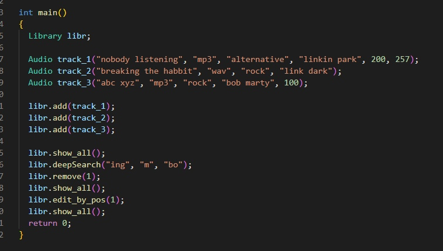

### Вариант 8

## Задание ✔️

- Описать класс «Каталог аудиозаписей» с полем - массив объектов класса «Аудиозапись».
  Предусмотреть возможность работы с произвольным числом аудиозаписей, поиска
  аудиозаписи по каким-либо признакам, добавления, редактирования и удаления
  аудиозаписи.
  
  
