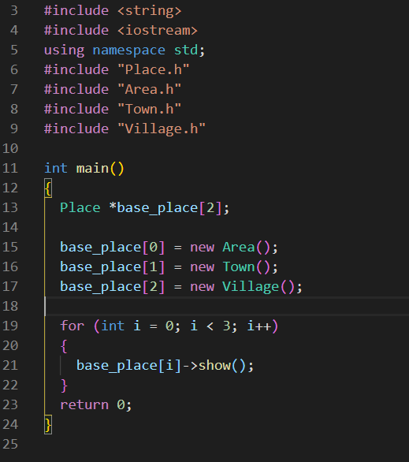
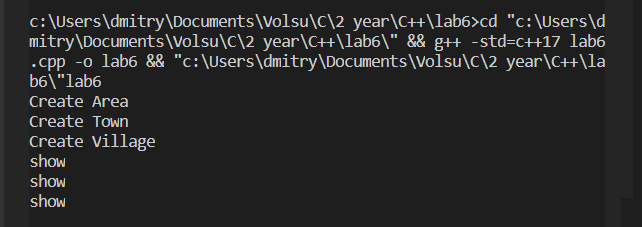

### Вариант 8

## Задание ✔️

- Классы – место (площадь, название, ...), область (количество населенных пунктов,
  руководство, ...), город (область, количество жителей, мэр, ...), деревня (район, ...)
  
  
