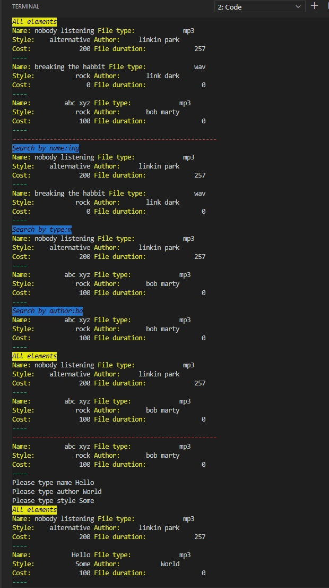

# Задание 1 (общее)

- Разработать приложение,

  - имеющее строку ввода данных,
  - кнопку запуска преобразования
  - текстовое поле, предназначенное только для отображения информации.
  - При этом не использовать QtDesigner!
  - Любой текст строки ввода должен отображаться в текстовом поле сразу после
    завершения ввода.
  - В начале строки должна быть вставлена пометка «input:». При нажатии кнопки
    преобразования строка ввода должна быть преобразована либо в верхний регистр, либо в нижний
    противоположно тому, что производилось при предыдущем нажатии кнопки.
    На рисунке показан возможный внешний вид приложения после
    ввода строки «123 abc DEF». Сразу после окончания ввода выдана
    строка «input: 123 abc DEF».
  - После первого нажатия кнопки
    «Convert» выведена строка «123 abc def», после второго - «123
    ABC DEF».

  - При реализации приложения допустимо изменение выполняемых
    функций, обязательно сохранив реакцию на завершение ввода
    (сигнал editingFinished (void) ) и считывание текста из поля ввода.
    Кроме того, необходимо наличие реакции хотя бы на одну кнопку

- сигнал click().

# Задание 2

- Используя по необходимости элементы интерфейса QT из раздела InputWidgets (LineEdit,
  TextEdit,…) реализовать обработку входных текстовых данных по своему варианту :

2. Дана строка. Вывести строку, содержащую те же символы, но расположенные в обратном
   порядке.

# Результат работы

